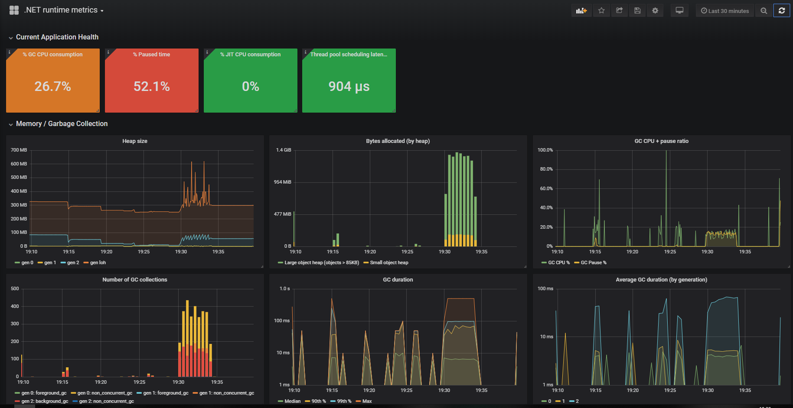

# prometheus-net.DotNetMetrics
A plugin for the [prometheus-net](https://github.com/prometheus-net/prometheus-net) package, exposing .NET core runtime metrics including:
- Garbage collection collection frequencies and timings by generation/ type, pause timings and GC CPU consumption ratio
- Heap size by generation
- Bytes allocated by small/ large object heap
- JIT compilations and JIT CPU consumption ratio
- Thread pool size, scheduling delays and reasons for growing/ shrinking
- Lock contention
- Exceptions thrown, broken down by type

These metrics are essential for understanding the peformance of any non-trivial application. Even if your application is well instrumented, you're only getting half the story- what the runtime is doing completes the picture.

## Installation
Supports .NET core v2.2+ but **.NET core v3.0+ is recommended**. There are a [number of bugs present in the .NET core 2.2 runtime](https://github.com/djluck/prometheus-net.DotNetRuntime/issues?q=is%3Aissue+is%3Aopen+label%3A".net+core+2.2+bug") 
that can impact metric collection or runtime stability.

Add the packge from [nuget](https://www.nuget.org/packages/prometheus-net.DotNetRuntime):
```powershell
# If you're using v3.* of prometheus-net
dotnet add package prometheus-net.DotNetRuntime

# If you're using v2.* of prometheus-net
dotnet add package prometheus-net.DotNetRuntime --version 2.2.0
```

And then start the collector:
```csharp
IDisposable collector = DotNetRuntimeStatsBuilder.Default().StartCollecting()
```

You can customize the types of .NET metrics collected via the `Customize` method:
```csharp
IDisposable collector = DotNetRuntimeStatsBuilder
	.Customize()
	.WithContentionStats()
	.WithJitStats()
	.WithThreadPoolSchedulingStats()
	.WithThreadPoolStats()
	.WithGcStats()
	.WithExceptionStats()
	.StartCollecting();
```

Once the collector is registered, you should see metrics prefixed with `dotnet_` visible in your metric output (make sure you are [exporting your metrics](https://github.com/prometheus-net/prometheus-net#http-handler)).
## Sample Grafana dashboard
The metrics exposed can drive a rich dashboard, giving you a graphical insight into the performance of your application ( [exported dashboard available here](examples/NET_runtime_metrics_dashboard.json)):


## Performance impact
The harder you work the .NET core runtime, the more events it generates. Event generation and processing costs can stack up, especially around these types of events:
- **JIT stats**: each method compiled by the JIT compiler emits two events. Most JIT compilation is performed at startup and depending on the size of your application, this could impact your startup performance.
- **GC stats**: every 100KB of allocations, an event is emitted. If you are consistently allocating memory at a rate > 1GB/sec, you might like to disable GC stats.
- **.NET thread pool scheduling stats**: For every work item scheduled on the thread pool, two events are emitted. If you are scheduling thousands of items per second on the thread pool, you might like to disable scheduling events or decrease the sampling rate of these events.

### Sampling
To counteract some of the performance impacts of measuring .NET core runtime events, sampling can be configured on supported collectors:
```csharp
IDisposable collector = DotNetRuntimeStatsBuilder.Customize()
	// Only 1 in 10 contention events will be sampled 
	.WithContentionStats(sampleRate: SampleEvery.TenEvents)
	// Only 1 in 100 JIT events will be sampled
	.WithJitStats(sampleRate: SampleEvery.HundredEvents)
	// Every event will be sampled (disables sampling)
	.WithThreadPoolSchedulingStats(sampleRate: SampleEvery.OneEvent)
	.StartCollecting();
```

The default sample rates are listed below:

| Event collector                | Default sample rate     |
| ------------------------------ | ------------------------|
| `ThreadPoolSchedulingStats`    | `SampleEvery.TenEvents` |
| `JitStats`                     | `SampleEvery.TenEvents` |
| `ContentionStats`              | `SampleEvery.TwoEvents` |

While the default sampling rates provide a decent balance between accuracy and resource consumption if you're concerned with the accuracy of metrics at all costs, 
then feel free to change the sampling rate to `SampleEvery.OneEvent`. If minimal resource consumption (especially memory), is your goal you might like to 
reduce the sampling rate.


## Further reading 
- The mechanism for listening to runtime events is outlined in the [.NET core 2.2 release notes](https://docs.microsoft.com/en-us/dotnet/core/whats-new/dotnet-core-2-2#core).
- A partial list of core CLR events is available in the [ETW events documentation](https://docs.microsoft.com/en-us/dotnet/framework/performance/clr-etw-events).